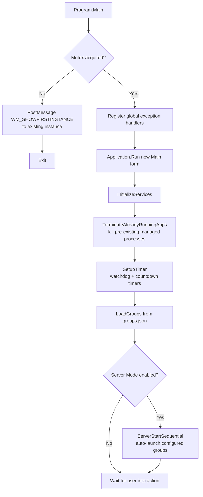
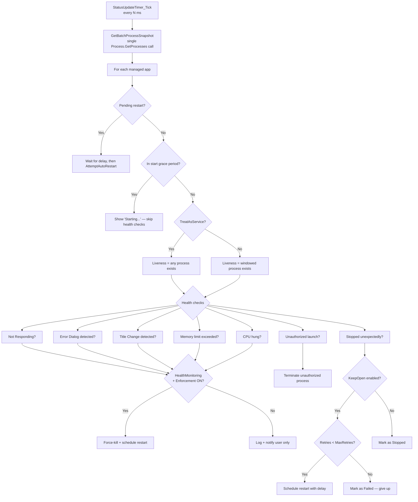
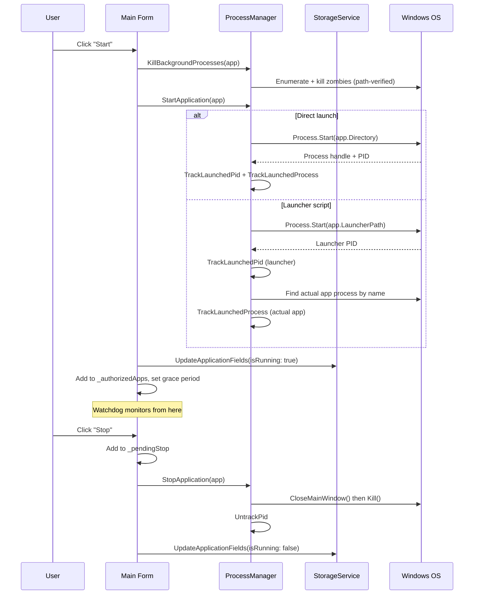

# Intelligent Mutex Execution Environment (IMEE) — Technical Documentation

> **Scope:** Full application — process management, watchdog monitoring, health enforcement, configuration, and storage.
> **Source:** Single WinForms codebase (.NET Framework 4.8) — `Form1.cs` (UI + watchdog), `Services/`, `Utilities/`, `Models/`.
> **Generated:** 2026-07-08.
> **Diagrams** render in GitHub, GitLab, Obsidian, and VS Code Markdown preview. For PDF export via Chrome print, pre-render with `mermaid-cli`.

---

## 1. Overview

IMEE is a Windows Forms desktop application that manages, monitors, and enforces the lifecycle of other Windows applications. It organises managed applications into **groups**, launches them through a controlled interface (or via launcher scripts), and runs a **watchdog timer** that continuously monitors process health — detecting crashes, UI freezes, error dialogs, memory leaks, CPU hangs, and zombie processes. When an issue is detected, IMEE can either notify the operator or automatically kill and restart the affected application, depending on per-app and global enforcement settings. The application is designed for 24/7 unattended operation on workstations and servers, with a system tray mode, auto-start on Windows boot, and server mode for headless auto-launch of configured groups.

---

## 2. Flow & Architecture

### 2.1 Application Startup Flow

This diagram shows the startup sequence. IMEE enforces **single-instance** via a named global Mutex. If a second instance is launched, it broadcasts a custom Windows message (`WM_SHOWFIRSTINSTANCE`) to restore the first instance's window, then exits. On first launch, it initialises three core services, terminates any managed apps that were already running (since they weren't launched through IMEE), starts the watchdog timer, and optionally auto-starts groups in server mode.

### 2.2 Watchdog Timer Tick — Process Monitoring Loop

This is the core of IMEE. Every `StatusPollIntervalMs` (default 10s), the watchdog takes a **single system-wide process snapshot** (one `Process.GetProcesses()` call for all apps), then iterates through every managed application across all groups — not just the visible one. Health checks are layered: not-responding detection, error dialog pattern matching, window title change detection, memory limit enforcement, and CPU-hung detection. Each check has a **two-gate system**: per-app `HealthMonitoringEnabled` and global `EnforcementEnabled`.

### 2.3 Application Start/Stop Lifecycle

This sequence shows the full lifecycle of starting and stopping an application. The **launcher path** feature allows IMEE to start apps via `.bat`, `.ps1`, `.vbs`, or `.cmd` scripts while still monitoring the actual application executable. Path verification (Patch 1/2) ensures IMEE never kills a same-named process from a different installation path.

---

## 3. Project Structure & File Responsibilities

IMEE is a single-tier WinForms application with a clean separation between UI, services, models, and utilities.

### 3.1 Core Application

| File                | Responsibility                                                                                                                                              |
| ------------------- | ----------------------------------------------------------------------------------------------------------------------------------------------------------- |
| `Program.cs`        | Entry point. Single-instance Mutex enforcement, global exception handlers, `WM_SHOWFIRSTINSTANCE` broadcast.                                                |
| `Form1.cs`          | Main form — UI event handlers, watchdog timer logic (`UpdateApplicationStatuses`), group/app management, system tray, server mode auto-start. ~1700+ lines. |
| `Form1.Designer.cs` | WinForms designer-generated layout: `SplitContainer`, `GroupListBox`, `AppListView` (10 columns), button panels, `NotifyIcon` + tray context menu.          |

### 3.2 Services

| File                          | Responsibility                                                                                                                                                                                                                                                                                                                           |
| ----------------------------- | ---------------------------------------------------------------------------------------------------------------------------------------------------------------------------------------------------------------------------------------------------------------------------------------------------------------------------------------- |
| `Services/ProcessManager.cs`  | Process lifecycle: `StartApplication`, `StopApplication`, `KillBackgroundProcesses`, `GetBatchProcessSnapshot`, `GetProcessSnapshot`, `IsApplicationRunning`. Win32 P/Invoke for cross-bitness path resolution (`QueryFullProcessImageName`), `EnumWindows` for tray app detection. PID/Process handle tracking for exit code retrieval. |
| `Services/StorageService.cs`  | JSON persistence for `applications.json` and `groups.json`. CRUD operations for groups and apps. Throttled writes (dirty tracking + configurable interval). Atomic file writes (write to `.tmp`, then `File.Replace`). Duplicate detection (`ApplicationExists`, `FindAuthorizedSibling`).                                               |
| `Services/SettingsService.cs` | JSON persistence for `settings.json`. All configurable settings with defaults, clamped ranges, and per-property change logging. Atomic file writes. Manual JSON serialization (no external dependencies).                                                                                                                                |

### 3.3 Models

| File                           | Responsibility                                                                                                                                                                                                                                                                                                                                                                                        |
| ------------------------------ | ----------------------------------------------------------------------------------------------------------------------------------------------------------------------------------------------------------------------------------------------------------------------------------------------------------------------------------------------------------------------------------------------------- |
| `Models/ManagedApplication.cs` | Data model for a managed app: `Index`, `GroupId`, `AppName`, `Directory`, `LauncherPath`, `KeepOpen`, `MaxRetries`, `StartDelaySeconds`, `StartupDelaySeconds`, `StableRunPeriodSeconds`, `NotRespondingTimeoutSeconds`, `MemoryLimitMB`, `DetectTitleChange`, `HealthMonitoringEnabled`, `TreatAsService`, `LastExitCode`, `SortOrder`, and runtime state (`IsRunning`, `CrashCount`, `RetryCount`). |
| `Models/ApplicationGroup.cs`   | Data model for a group: `GroupId`, `GroupName`, `CreatedDate`.                                                                                                                                                                                                                                                                                                                                        |

### 3.4 Utilities

| File                              | Responsibility                                                                                                                                                                                                                                                                              |
| --------------------------------- | ------------------------------------------------------------------------------------------------------------------------------------------------------------------------------------------------------------------------------------------------------------------------------------------- |
| `Utilities/SimpleLogger.cs`       | Thread-safe buffered file logger. Format: `[MACHINE][TIMESTAMP][LEVEL][PID][LOCATION] - MESSAGE`. Daily log rotation, configurable flush interval/buffer size/retention.                                                                                                                    |
| `Utilities/StartupManager.cs`     | Windows Registry `HKCU\...\Run` key management for auto-start on boot. No admin rights required.                                                                                                                                                                                            |
| `Utilities/SettingsDialog.cs`     | Settings UI: General (station name, run on startup), Performance (poll interval, grace period, GC interval, save interval — with preset profiles), Logging (flush interval, buffer size, retention days), Enforcement toggle.                                                               |
| `Utilities/AppSettingsDialog.cs`  | Per-app settings UI (`EditAppDialog`): application path, launcher path, KeepOpen, max retries, start delay, startup delay, stable run period, not-responding timeout, memory limit, title change detection, health monitoring, treat-as-service. Crash/retry statistics with reset buttons. |
| `Utilities/ServerConfigDialog.cs` | Server mode configuration: enable/disable, auto-run all groups or selected groups.                                                                                                                                                                                                          |
| `Utilities/CustomMessageBox.cs`   | Themed message box replacement with AUMOVIO Screen font, custom icon rendering, and owner-centered positioning.                                                                                                                                                                             |
| `Utilities/InputDialog.cs`        | Simple text input dialog for group name entry.                                                                                                                                                                                                                                              |
| `Utilities/MessageBoxHelper.cs`   | Facade over `CustomMessageBox` — `ShowSuccess`, `ShowError`, `ShowWarning`, `ShowInfo`, `ShowQuestion`. Falls back to standard `MessageBox` when no owner form is available.                                                                                                                |
| `Utilities/MarkdownParser.cs`     | Lightweight Markdown-to-HTML converter for the in-app User Guide. Supports headings, bold/italic, code blocks, blockquotes, lists, links, images, and horizontal rules. Zero external dependencies.                                                                                         |

### 3.5 Tests

| File                  | Responsibility                                                                                                                                                                                                                                                                                                                                     |
| --------------------- | -------------------------------------------------------------------------------------------------------------------------------------------------------------------------------------------------------------------------------------------------------------------------------------------------------------------------------------------------- |
| `Tests/PatchTests.cs` | Standalone console test suite covering Patches 0–5 and 5 gap fixes. Uses P/Invoke directly (no test framework dependency). Tests: `TryGetProcessPath`, `ProcessPathMatches`, path gate in kill operations, snapshot path filter, `TreatAsService` liveness, kill attribution, enforcement gating, edge cases, stress tests, and regression matrix. |

---

## 4. Configuration & Settings

### 4.1 Settings File (`settings.json`)

Persisted at `{AppDomain.BaseDirectory}/settings.json`. All values are clamped to safe ranges.

| Setting                      | Type   | Default | Range      | Purpose                                                                                                              |
| ---------------------------- | ------ | ------- | ---------- | -------------------------------------------------------------------------------------------------------------------- |
| `StationName`                | string | `""`    | —          | Display name shown in the header (e.g. workstation identifier).                                                      |
| `RunOnStartup`               | bool   | `false` | —          | Register IMEE in `HKCU\...\Run` for Windows auto-start.                                                              |
| `IsServerMode`               | bool   | `false` | —          | Enable server mode (auto-launch groups on startup).                                                                  |
| `ServerAutoRunMode`          | int    | `0`     | 0–2        | 0 = Disabled, 1 = All Groups, 2 = Selected Groups.                                                                   |
| `ServerAutoRunGroupIds`      | string | `""`    | —          | Comma-separated group IDs for mode 2.                                                                                |
| `StatusPollIntervalMs`       | int    | `10000` | 1000–60000 | Watchdog polling interval in milliseconds.                                                                           |
| `StartGracePeriodSeconds`    | int    | `10`    | 1–120      | Seconds after launch before watchdog monitoring begins.                                                              |
| `GcCollectIntervalMinutes`   | int    | `30`    | 5–1440     | Periodic `GC.Collect(1, Optimized)` to prevent memory growth during 24/7 operation.                                  |
| `StorageSaveIntervalSeconds` | int    | `30`    | 5–300      | Minimum interval between throttled storage writes.                                                                   |
| `LogFlushIntervalSeconds`    | int    | `10`    | 1–120      | How often buffered log entries are flushed to disk.                                                                  |
| `LogBufferSize`              | int    | `100`   | 10–1000    | Max buffered entries before forced flush.                                                                            |
| `LogRetentionDays`           | int    | `7`     | 1–365      | Days to retain log files before automatic cleanup.                                                                   |
| `EnforcementEnabled`         | bool   | `false` | —          | Global kill switch. `false` = LogOnly (dry-run), `true` = active enforcement. **Ships as `false` for safe rollout.** |

### 4.2 Performance Profiles

The Settings dialog offers preset profiles that tune multiple performance settings at once:

| Profile       | Poll (ms) | Grace (s) | GC (min) | Save (s) | Flush (s) | Buffer |
| ------------- | --------- | --------- | -------- | -------- | --------- | ------ |
| Very High     | 2000      | 5         | 10       | 10       | 2         | 50     |
| High          | 3000      | 7         | 15       | 15       | 5         | 75     |
| Med (Default) | 10000     | 10        | 30       | 30       | 10        | 100    |
| Low           | 20000     | 20        | 60       | 90       | 20        | 300    |
| Very Low      | 30000     | 30        | 90       | 120      | 30        | 500    |

### 4.3 Per-Application Settings

Each `ManagedApplication` has these configurable properties:

| Property                      | Default | Purpose                                                                         |
| ----------------------------- | ------- | ------------------------------------------------------------------------------- |
| `KeepOpen`                    | `false` | Auto-restart on crash.                                                          |
| `MaxRetries`                  | `3`     | Max consecutive restart attempts before marking as Failed.                      |
| `StartDelaySeconds`           | `5`     | Delay before auto-restart after crash.                                          |
| `StartupDelaySeconds`         | `10`    | Delay before this app in sequential "Start All" launch.                         |
| `StableRunPeriodSeconds`      | `30`    | How long the app must run stably before retry count resets to 0.                |
| `NotRespondingTimeoutSeconds` | `0`     | Seconds before force-killing a not-responding app. 0 = 2 poll cycles (default). |
| `MemoryLimitMB`               | `0`     | Working set limit. 0 = disabled.                                                |
| `DetectTitleChange`           | `false` | Track window title changes as potential error dialogs.                          |
| `HealthMonitoringEnabled`     | `false` | Enable active health checks (not-responding, error dialog, memory, CPU).        |
| `TreatAsService`              | `false` | Windowless/service app: liveness = process exists (skips window-based checks).  |
| `LauncherPath`                | `null`  | Optional launcher script/exe. IMEE launches this but monitors the primary exe.  |

### 4.4 Data Files

| File                    | Location                | Format                    | Purpose                                                    |
| ----------------------- | ----------------------- | ------------------------- | ---------------------------------------------------------- |
| `applications.json`     | `{BaseDirectory}/`      | JSON array                | All managed applications across all groups.                |
| `groups.json`           | `{BaseDirectory}/`      | JSON array                | All application groups.                                    |
| `settings.json`         | `{BaseDirectory}/`      | JSON object               | Global settings.                                           |
| `logs/{YYYY-MM-DD}.log` | `{BaseDirectory}/logs/` | Text (one line per entry) | Daily log files with machine/timestamp/level/PID/location. |

All JSON files use **atomic writes**: write to `.tmp` first, then `File.Replace` (or `File.Move` if primary doesn't exist). On load, if the primary file is missing or corrupt, the `.tmp` fallback is checked.

---

## 5. Core Functional Flows

### 5.1 Group Management

Groups are the top-level organisational unit. The UI has a `ListBox` on the left panel with Add/Edit/Delete buttons. Groups are owner-drawn with colour-coded status indicators:

- **Green** — All apps in the group are running.
- **Orange** — Some apps are running.
- **No indicator** — No apps running or group is empty.

Deleting a group stops all running apps in that group and removes all app entries.

### 5.2 Application Management

Apps are displayed in a `ListView` with 10 columns: Index, Application, Directory, Status, Keep Open, Crashes, Retries, Last Start, Last Stop, Exit Code. Apps support **drag-to-reorder** within a group (persisted via `SortOrder`).

**Status states:** `Stopped`, `Stopped (Crashed)`, `Starting...`, `Running`, `Running (Other Group)`, `Waiting (Ns)`, `Restarting (Ns)`, `Stopping...`, `Failed`.

### 5.3 Start All — Sequential Launch

"Start All" launches all apps in the selected group sequentially, respecting each app's `StartupDelaySeconds`. A live countdown (`Waiting (5s)`, `Waiting (4s)`, ...) is displayed in the Status column. This prevents resource contention from launching many apps simultaneously.

### 5.4 Cross-Group Duplicate Detection

The same executable can be added to multiple groups. When it's started from one group, other groups show `Running (Other Group)` in cyan. `FindAuthorizedSibling` checks the `_authorizedApps` set to determine which group entry "owns" the running process, preventing false unauthorized-launch detections.

### 5.5 System Tray Integration

Closing the window prompts: "Minimize to Tray" / "Close" / "Cancel". When minimised to tray, a `NotifyIcon` with a context menu (Restore / Exit) remains. Double-clicking the tray icon restores the window. The `WM_SHOWFIRSTINSTANCE` message also restores from tray when a second instance is launched.

### 5.6 Launcher Script Support

Apps can be configured with a `LauncherPath` pointing to a `.bat`, `.cmd`, `.ps1`, or `.vbs` script. IMEE launches the script via the appropriate interpreter (`cmd.exe`, `powershell.exe`, `cscript.exe`) but monitors the primary executable (`Directory`) for process detection. This supports scenarios where apps need environment setup before launch.

---

## 6. Technicalities

### 6.1 Single-Instance Enforcement

Uses a named global Mutex (`Global\IntelligentMutexExecutionEnvironment_SingleInstance_Mutex`). The second instance broadcasts a custom registered Windows message (`WM_SHOWFIRSTINSTANCE`) via `PostMessage(HWND_BROADCAST, ...)`. The first instance overrides `WndProc` to handle this message and restore its window.

### 6.2 Process Detection — Path-Based Filtering (Patches 0–2)

A critical design challenge: multiple installations of the same application (same `.exe` name) at different paths. IMEE uses `QueryFullProcessImageName` (Win32 API) to resolve the full image path of each process, then compares it against the configured `Directory`.

**Asymmetry rule:**

- **Detection is permissive:** If the process path can't be resolved (access denied), it's treated as a match — IMEE won't go blind to its own apps.
- **Enforcement is strict:** If the process path can't be resolved, the kill is skipped — IMEE won't kill what it can't identify.

This is implemented in `ProcessManager.TryGetProcessPath()` and `ProcessPathMatches()`.

### 6.3 Batch Process Snapshot

Instead of calling `Process.GetProcessesByName()` per app (which internally enumerates ALL system processes each time), IMEE calls `Process.GetProcesses()` **once** per timer tick, then matches process names against all managed apps in a single pass. Similarly, `EnumWindows` is called once to build a `HashSet<uint>` of all PIDs with top-level windows, replacing per-process window enumeration. This is O(P + A) instead of O(P × A) where P = system processes and A = managed apps.

### 6.4 Exit Code Tracking

On `.NET Framework 4.0`, `Process.ExitCode` is only available while the `Process` handle is open. IMEE keeps the `Process` object alive in `_appProcessHandles` (not disposed) until the exit code is read. For launcher-started apps, the actual app's `Process` handle is tracked separately from the launcher's handle via `TryTrackActualAppProcess`.

Exit codes are displayed in hex for non-zero values (e.g. `0xC0000005` for access violation) and classified into human-readable descriptions (`ClassifyExitCode`).

### 6.5 Health Monitoring — Two-Gate System

Every health enforcement action passes through two gates:

1. **Per-app gate:** `app.HealthMonitoringEnabled` — must be `true` for the app.
2. **Global gate:** `_settingsService.EnforcementEnabled` — must be `true` globally.

If the global gate is `false`, all enforcement actions are logged as `[DRY-RUN]` but never executed. This allows operators to observe what IMEE _would_ do before enabling active enforcement.

### 6.6 Health Check Details

| Check              | Detection Method                                                                               | Confirmation                                | Action                    |
| ------------------ | ---------------------------------------------------------------------------------------------- | ------------------------------------------- | ------------------------- |
| **Not Responding** | `Process.Responding == false`                                                                  | Configurable timeout or 2 consecutive ticks | Force-kill + auto-restart |
| **Error Dialog**   | Window title matches 28 patterns (e.g. "unhandled exception", "fatal error", ".NET Framework") | 2 consecutive detections                    | Force-kill + auto-restart |
| **Title Change**   | Window title differs from baseline captured after grace period                                 | 2 consecutive detections                    | Force-kill + auto-restart |
| **Memory Limit**   | `Process.WorkingSet64` exceeds `MemoryLimitMB`                                                 | Immediate                                   | Force-kill + auto-restart |
| **CPU Hung**       | CPU usage ≥ 95% for 3 consecutive ticks                                                        | 3 consecutive ticks                         | Force-kill + auto-restart |
| **Zombie Process** | Background process exists with no window (non-service apps)                                    | Immediate                                   | Kill background processes |

### 6.7 Force-Kill Attribution (Patch 4)

When the health monitor force-kills a process, the reason is stored in `_forceKillReason[appIndex]` _before_ the kill. On the next tick, when the watchdog detects the app has stopped, it uses this pre-recorded reason instead of classifying the forced termination's exit code (which would be misleading, e.g. "General error (exit code 1)" from `TerminateProcess`).

### 6.8 Stable Run Period & Retry Reset

After an auto-restart, the app must run for `StableRunPeriodSeconds` (default 30s) before the retry counter resets to 0. This prevents an app that crashes every 31 seconds from running indefinitely with a perpetually-reset retry counter.

### 6.9 TreatAsService Mode (Patch 3)

For windowless/service-style apps: liveness is determined by process existence (not window existence). Window-based health checks (not-responding, error dialog, title change) are skipped since they're meaningless without a message pump. Memory and CPU checks remain active. Pre-start zombie cleanup is also skipped.

### 6.10 Throttled Storage Writes

`StorageService` uses dirty tracking (`_appsDirty`, `_groupsDirty`) and a configurable minimum save interval. Timer-tick updates (transient state like `IsRunning`) use `UpdateApplicationTransient` which only writes to disk when the dirty flag is set AND the interval has elapsed. User-initiated changes (Add, Edit, Delete) always write immediately via `SaveApplications()`.

### 6.11 Logging Architecture

`SimpleLogger` is a static, thread-safe, buffered file logger. Key design decisions:

- **Buffered writes:** Entries accumulate in a `List<string>` and flush on: buffer full, ERROR/FATAL level, or flush interval elapsed.
- **Daily rotation:** Log file name is `{YYYY-MM-DD}.log`.
- **Automatic cleanup:** Files older than `LogRetentionDays` are deleted (checked once per 24 hours).
- **Machine identifier:** Cached at startup — includes machine name, OS version, and .NET version.
- **Silent failure:** Logging never throws. If disk write fails and buffer exceeds 2× max size, it's discarded to prevent unbounded memory growth.

### 6.12 Installation & Deployment

- **No admin rights required.** Installs to `%LOCALAPPDATA%\MES\IMEEv1.0.0.17`.
- `install.bat`: Copies Release build output, creates desktop shortcut via PowerShell.
- `uninstall.bat`: Kills running process, removes shortcut, deletes install directory.
- Auto-start uses `HKCU\SOFTWARE\Microsoft\Windows\CurrentVersion\Run` (no admin).

---

## 7. Security

### 7.1 Process Kill Safety

IMEE manages process lifecycles, so incorrect kills are a critical risk:

- **Path verification (Patches 0–2):** Every kill operation verifies the process image path matches the configured `Directory` before terminating. This prevents killing a same-named process from a different installation.
- **Enforcement gate (Patch 5):** Global `EnforcementEnabled` defaults to `false`. All automated kills are gated behind this flag. Ships as `false` for safe production rollout.
- **Fail-safe asymmetry:** Detection is permissive (unknown path = match), enforcement is strict (unknown path = skip). This ensures IMEE can always _see_ its apps but never _kills_ what it can't identify.

### 7.2 Data Storage

- **No encryption:** `settings.json`, `applications.json`, and `groups.json` are stored as plaintext JSON. No secrets are stored (no passwords, tokens, or API keys).
- **Atomic writes:** All JSON files use write-to-temp + replace to prevent corruption from crashes or power loss.
- **No network communication:** IMEE makes zero HTTP requests. All data is local.

### 7.3 Registry Access

- Uses `HKCU` (current user) only — no `HKLM` access, no admin elevation required.
- Only writes to `SOFTWARE\Microsoft\Windows\CurrentVersion\Run` for auto-start.

### 7.4 Win32 P/Invoke Surface

IMEE uses several Win32 APIs via P/Invoke:

| API                                         | Purpose                       | Risk                                                            |
| ------------------------------------------- | ----------------------------- | --------------------------------------------------------------- |
| `OpenProcess` + `QueryFullProcessImageName` | Resolve process image path    | Read-only, `PROCESS_QUERY_LIMITED_INFORMATION` (minimal access) |
| `EnumWindows` + `GetWindowThreadProcessId`  | Detect tray/hidden windows    | Read-only enumeration                                           |
| `PostMessage` + `RegisterWindowMessage`     | Single-instance communication | Broadcast to `HWND_BROADCAST`                                   |
| `ShowWindow` + `SetForegroundWindow`        | Restore window from tray      | UI only                                                         |

All P/Invoke calls are wrapped in try/catch and fail silently or return safe defaults.

### 7.5 Exception Handling

- **UI thread:** `Application.ThreadException` handler shows error dialog but attempts to continue.
- **Non-UI thread:** `AppDomain.CurrentDomain.UnhandledException` handler logs and shows fatal error.
- **Timer tick:** Entire `UpdateApplicationStatuses` is wrapped in try/catch with `_isUpdatingStatuses` re-entrancy guard.
- **Logging:** `SimpleLogger` never throws — all operations are wrapped in catch-all handlers.

### 7.6 Relevant Exposure Classes

| Category                                  | Status                                                                                                     |
| ----------------------------------------- | ---------------------------------------------------------------------------------------------------------- |
| **Injection (OWASP A03)**                 | N/A — no SQL, no HTTP, no user-supplied strings in commands. Process paths come from file browser dialogs. |
| **Broken Access Control (OWASP A01)**     | Low risk — single-user desktop app. No authentication. Registry access is user-scoped.                     |
| **Security Misconfiguration (OWASP A05)** | `EnforcementEnabled` defaults to `false` (safe). Settings are clamped to valid ranges.                     |
| **Sensitive Data Exposure (OWASP A02)**   | No secrets stored. Log files contain process names and paths (not sensitive).                              |

---

## 8. Verification Q&A

> **Q:** Does IMEE enforce single-instance correctly?
> **A:** Yes. A named global Mutex (`Global\IntelligentMutexExecutionEnvironment_SingleInstance_Mutex`) is acquired in `Program.Main`. If `createdNew` is `false`, the second instance broadcasts `WM_SHOWFIRSTINSTANCE` and exits.
> **Evidence:** Manual verification via code inspection (`Program.cs:30-44`). **⚠ No automated test covers this** — it requires launching two instances, which is inherently an integration/manual test.

> **Q:** Does path-based filtering prevent killing a same-named process from a different installation?
> **A:** Yes. `ProcessPathMatches` resolves the full image path via `QueryFullProcessImageName` and compares case-insensitively with trailing backslash normalization.
> **Evidence:** `Tests/PatchTests.cs` → `TestPatch0_ProcessPathMatches` — asserts self-match, case-insensitive match, trailing backslash normalization, wrong path rejection, null/empty fail-safe. `TestPatch1_PathGate_LiveProcess` — launches `notepad.exe`, verifies it matches its own path but NOT a fake path. _Status: not run._

> **Q:** Does the enforcement gate prevent kills when `EnforcementEnabled` is `false`?
> **A:** Yes. Every kill path in `Form1.cs` and `ProcessManager.cs` checks `_settingsService.EnforcementEnabled` and logs `[DRY-RUN]` instead of killing.
> **Evidence:** `Tests/PatchTests.cs` → `TestPatch5_EnforcementEnabled` — asserts `SimulateGate(false, true) == false` (no kill in dry-run) and `SimulateGate(true, true) == true` (kill proceeds when enabled). `TestIntegration_KillPathCoverage` — verifies all 11 kill paths have enforcement gates. _Status: not run._

> **Q:** Does `TreatAsService` correctly detect windowless apps as running?
> **A:** Yes. The liveness check is `treatAsService ? (hasWindowed || hasBackground) : hasWindowed`.
> **Evidence:** `Tests/PatchTests.cs` → `TestPatch3_TreatAsService` — asserts `TreatAsService + background-only = Running`, `Normal + background-only = NOT Running`, and that window-based health checks are skipped for service apps. _Status: not run._

> **Q:** Does atomic file writing prevent data corruption?
> **A:** Yes. Both `StorageService` and `SettingsService` write to a `.tmp` file first, then use `File.Replace` (or `File.Move` if the primary doesn't exist). On load, if the primary file is missing or empty, the `.tmp` fallback is checked.
> **Evidence:** Code inspection of `StorageService.WriteFileAtomically` and `SettingsService.Save`. **⚠ No automated test covers this** — would require simulating a crash mid-write.

> **Q:** Does the stable run period correctly reset retry counts?
> **A:** Yes. After auto-restart, `_stableRunCheck[appIndex]` is set to `DateTime.Now.AddSeconds(stableRunPeriod)`. When the watchdog detects the app has been running past this time, it resets `RetryCount` to 0 and clears `LastExitCode`.
> **Evidence:** Code inspection of `Form1.cs` → `UpdateApplicationStatuses` stable run check block. **⚠ No automated test covers this** — requires time-based integration testing.

> **Q:** Are all kill paths covered by path verification AND enforcement gating?
> **A:** Yes. The test suite explicitly enumerates all 11 kill paths and verifies each has both gates.
> **Evidence:** `Tests/PatchTests.cs` → `TestIntegration_KillPathCoverage` — lists all kill paths including `KillBackgroundProcesses`, `StopApplication`, `HandleUnauthorizedLaunch`, not-responding, error-dialog, title-change, memory-limit, CPU-hung, `TerminateAlreadyRunningApps`, user Stop, and Delete Group. _Status: not run._

### Coverage Summary

| Behaviour                                                 | Test Coverage                                  |
| --------------------------------------------------------- | ---------------------------------------------- |
| Path resolution (`TryGetProcessPath`)                     | ✅ Covered — Patch 0 tests                     |
| Path matching (`ProcessPathMatches`)                      | ✅ Covered — Patch 0 tests + live notepad test |
| Path gate in kill operations                              | ✅ Covered — Patch 1 + Gap Fix 1               |
| Snapshot path filter                                      | ✅ Covered — Patch 2                           |
| TreatAsService liveness                                   | ✅ Covered — Patch 3                           |
| Kill attribution                                          | ✅ Covered — Patch 4                           |
| Enforcement gating                                        | ✅ Covered — Patch 5 + Gap Fix 4               |
| Kill path coverage matrix                                 | ✅ Covered — Integration test                  |
| Detection path coverage                                   | ✅ Covered — Integration test                  |
| Edge cases (spaces, trailing slashes, mid-session toggle) | ✅ Covered                                     |
| Stress (multiple same-name processes)                     | ✅ Covered                                     |
| Single-instance Mutex                                     | ⚠ No test                                      |
| Atomic file writes                                        | ⚠ No test                                      |
| Stable run period / retry reset                           | ⚠ No test                                      |
| Sequential start countdown                                | ⚠ No test                                      |
| System tray minimize/restore                              | ⚠ No test                                      |
| Server mode auto-start                                    | ⚠ No test                                      |

The test suite (`PatchTests.cs`) is a standalone console app with 50+ assertions covering the process safety patches. UI-level and time-dependent behaviours (tray, sequential start, stable run) are untested — they would require a UI automation framework or time-mocking infrastructure.
